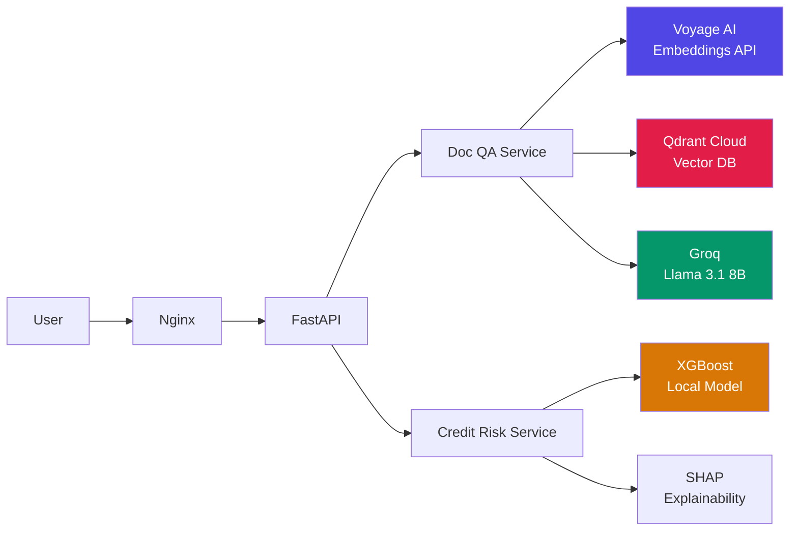

# Kaio H. Siqueira — ML Engineer Portfolio

<div align="center">

**Two production ML systems. Zero cloud bill. Real engineering decisions.**

[](https://kaio.ia.br)

[](https://fastapi.tiangolo.com/)
[](https://www.python.org/)
[](https://podman.io/)
[](app/middleware/)
[](LICENSE)

**[Live Demo](https://kaio.ia.br)** · [Doc QA](#1-doc-qa--rag-document-assistant) · [Credit Risk](#2-credit-risk-scoring-api) · [Quick Start](#quick-start) · [Deployment](DEPLOYMENT.md)

</div>

---

## Why this project?

Most ML portfolios are notebooks with clean datasets. This one is a FastAPI monorepo serving two ML systems — a RAG pipeline and a credit risk classifier — that run together in production on a 2GB VPS for $0/month. Every architectural decision (Voyage AI over local embeddings, HTMX over React, Qdrant Cloud over in-memory) is a deliberate trade-off between latency, RAM, and operational cost, not a default choice. The goal was to answer: *can you build something a fintech or AI startup would actually ship?*

---

## Key Metrics

| System | Metric | Value |
|--------|--------|-------|
| **Doc QA** | End-to-end latency (p50) | ~280ms |
| **Doc QA** | End-to-end latency (p99) | ~450ms |
| **Doc QA** | Hallucination rate (CoVe) | ~2% (vs ~10% baseline) |
| **Doc QA** | RAM usage | ~150MB (API embeddings, no local model) |
| **Credit Risk** | AUC-ROC | >0.75 (97k applications) |
| **Credit Risk** | Inference latency (p95) | <100ms |
| **Credit Risk** | SHAP explanation features | Top 5 per prediction |
| **Both** | Monthly infrastructure cost | $0 (free tiers) |

---

## Architecture



**Request flow**: Nginx (reverse proxy + TLS) → FastAPI → project service layer → external APIs or local ML model → HTMX partial response.

---

## Projects

### 1. Doc QA — RAG Document Assistant

Upload a PDF, ask questions, get cited answers with hallucination verification.

**Stack**: Voyage AI (embeddings) → Qdrant Cloud (vector search) → Groq llama-3.1-8b → Chain-of-Verification

| Feature | Implementation |
|---------|---------------|
| Chunking | 400 tokens, 50 overlap, SHA-256 deduplication |
| Retrieval | Semantic search + BM25 reranking (hybrid) |
| Verification | Chain-of-Verification: source citation + context grounding checks |
| Rate limiting | 15 queries/IP/month, persisted to JSON |
| Cost | $0/month — Voyage 200M lifetime tokens + Qdrant 1GB free + Groq free tier |

[→ Full documentation](app/projects/docqa/)

---

### 2. Credit Risk Scoring API

Submit a loan application, get a risk score with SHAP-explained factors.

**Stack**: XGBoost trained on 97k Kaggle applications + SHAP TreeExplainer

| Feature | Implementation |
|---------|---------------|
| Dataset | 430k applications, 97k after merge (Kaggle credit risk dataset) |
| Features | 30+ engineered features (income ratios, employment stability, digital score) |
| Explainability | SHAP Shapley values — top 5 features with direction per prediction |
| Risk categories | LOW / MEDIUM / HIGH / VERY HIGH with confidence score |
| Response | JSON API + interactive HTMX form, both i18n'd (PT-BR / EN-US) |

[→ Full documentation](app/projects/creditrisk/)

---

## Technical Decisions

These are the choices that aren't obvious, and why I made them.

**Voyage AI instead of a local embedding model**

Local models (FastEmbed, sentence-transformers) require 400–700MB RAM and ~200ms CPU inference per query. On a 2GB VPS that also runs XGBoost, that's the entire memory budget. Voyage AI's API returns `voyage-3-lite` embeddings in ~50ms over HTTPS with 200M free lifetime tokens. For a portfolio serving intermittent traffic, the latency tradeoff is irrelevant and the RAM savings are critical.

**HTMX instead of React / Next.js**

This backend returns HTML fragments over HTTP. A React SPA would add 40–150KB of JavaScript, a build step, a Node runtime for SSR, and a separate API layer — none of which this project needs. HTMX adds 14KB and lets FastAPI return partial HTML directly. The result is the same user experience with 90% less frontend complexity and zero JavaScript framework to maintain.

**Podman instead of Docker**

Podman runs rootless by default. On a shared VPS, a process running as root inside Docker can escape to the host under certain conditions. Podman containers run as the unprivileged user, eliminating that attack surface. The API is compatible with Docker Compose files, so there's no migration cost.

**Groq instead of OpenAI**

Groq's free tier provides `llama-3.1-8b-instant` at ~300 tokens/second with no credit card. For a portfolio RAG system, the quality is sufficient and the cost is $0. The generation service has a fallback chain (Groq → Perplexity → OpenAI) for resilience.

**FastAPI instead of Flask/Django**

Async I/O matters when you're making 2–3 external API calls per request (embeddings, vector search, LLM). FastAPI's native async support means those calls run concurrently, not sequentially. Pydantic models give you free input validation and OpenAPI docs.

---

## Quick Start

**Requirements**: Python 3.11+, 2GB+ RAM, Kaggle account (for Credit Risk dataset)

```bash
# 1. Clone and set up environment
git clone https://github.com/KaioH3/kaio-portfolio.git
cd kaio-portfolio
python -m venv venv && source venv/bin/activate
pip install -r requirements.txt

# 2. Configure API keys
cp .env.example .env
# Edit .env — required for Doc QA: GROQ_API_KEY, VOYAGE_API_KEY, QDRANT_URL, QDRANT_API_KEY

# 3. Run
uvicorn app.main:app --reload
# → http://localhost:8000
```

**Credit Risk model** (trains in ~3 minutes on CPU):

```bash
# Download Kaggle dataset first
mkdir -p ~/.kaggle
mv ~/Downloads/kaggle.json ~/.kaggle/ && chmod 600 ~/.kaggle/kaggle.json

# Train
python -m app.projects.creditrisk.services.model_training
```

**Run tests**:

```bash
pytest                                       # all tests
pytest tests/test_creditrisk.py -v          # credit risk
pytest tests/test_rag_system.py -v          # doc qa
```

---

## Project Structure

```
kaio-portfolio/
├── app/
│   ├── core/            # Global config, structured logging
│   ├── middleware/      # OWASP security, rate limiting, quota tracking
│   ├── routers/         # Home, health endpoints
│   └── projects/
│       ├── docqa/       # RAG pipeline (config, models, routes, services, templates)
│       ├── creditrisk/  # XGBoost + SHAP (same pattern)
│       └── landing/     # Portfolio landing page
├── deploy/
│   ├── systemd/         # Service unit template
│   └── podman-compose.yml
├── scripts/             # vps-setup.sh, vps-update.sh, build.sh
├── static/              # CSS design system, HTMX
├── templates/           # base.html
├── Makefile             # make dev / make deploy VPS_HOST=...
├── .env.example         # All required variables documented
└── DEPLOYMENT.md        # VPS setup guide
```

Each ML project follows the same pattern: `config.py` (Pydantic Settings) → `models.py` (schemas) → `routes.py` (FastAPI router) → `services/` (business logic, singletons) → `templates/` (Jinja2 + HTMX) → `i18n.py` (PT-BR/EN-US).

---

## Security

| Layer | Implementation |
|-------|---------------|
| Input validation | Pydantic strict schemas on all endpoints |
| Rate limiting | Per-IP monthly quotas (Doc QA), per-hour API quotas (Qdrant, Groq) |
| Headers | HSTS, CSP, X-Frame-Options, X-Content-Type-Options |
| Container | Rootless Podman, `no-new-privileges`, `PrivateTmp`, `MemoryMax` |
| Secrets | Environment variables only, never in logs or responses |
| CORS | Explicit origin whitelist via `ALLOWED_ORIGINS` env var |

---

## Tech Stack

| Layer | Technology | Why |
|-------|-----------|-----|
| API framework | FastAPI 0.115 | Native async, Pydantic validation, OpenAPI |
| ML — classification | XGBoost + SHAP | Fast inference, compliance-ready explainability |
| ML — embeddings | Voyage AI `voyage-3-lite` | Zero RAM, 200M free tokens |
| Vector DB | Qdrant Cloud | 1GB free tier, payload filtering |
| LLM | Groq `llama-3.1-8b-instant` | 300 tok/s, free tier, fallback chain |
| Frontend | HTMX + Jinja2 | No build step, partial HTML updates |
| CSS | Custom design system (3.48KB) | No framework dependency |
| Container | Podman (rootless) | No daemon, no root |
| Process | systemd | Auto-restart, resource limits |
| Reverse proxy | Nginx | TLS termination, `client_max_body_size` |

---

## Contact

**Kaio H. Siqueira**
Self-taught engineer, programming since age 14 · Linux-native since 16 · Production deployments since 2023

[](https://github.com/KaioH3)
[](https://www.linkedin.com/in/kaiohsiqueira/)
[](https://medium.com/@KaioH3)
[](mailto:contato@kaio.ia.br)

---

<details>
<summary>Leia em Português</summary>

## Portfólio ML Engineering — Kaio H. Siqueira

Dois sistemas ML em produção. Zero custo de infraestrutura. Decisões de engenharia reais.

**[Demo ao vivo](https://kaio.ia.br)**

### Por que este projeto?

A maioria dos portfólios ML são notebooks com datasets limpos. Este é um monorepo FastAPI servindo dois sistemas ML — um pipeline RAG e um classificador de risco de crédito — que rodam juntos em produção em um VPS de 2GB por $0/mês. Cada decisão arquitetural (Voyage AI vs embeddings locais, HTMX vs React, Qdrant Cloud vs in-memory) é um trade-off deliberado entre latência, RAM e custo operacional.

### Projetos

**Doc QA** — Faça upload de um PDF, faça perguntas, receba respostas citadas com verificação de alucinações. Stack: Voyage AI → Qdrant Cloud → Groq llama-3.1-8b → Chain-of-Verification.

**Credit Risk API** — Envie uma aplicação de crédito, receba score de risco com top 5 fatores explicados via SHAP. Modelo XGBoost treinado em 97k aplicações do Kaggle.

### Decisões Técnicas

- **Voyage AI em vez de modelo local**: modelos locais (FastEmbed) consomem 400-700MB RAM. No VPS de 2GB que também roda XGBoost, isso é impraticável. Voyage AI retorna embeddings em ~50ms via HTTPS com 200M tokens gratuitos vitalícios.
- **HTMX em vez de React**: o backend retorna fragmentos HTML. React adicionaria 40-150KB de JavaScript, um passo de build e um runtime Node sem nenhum benefício real aqui.
- **Podman em vez de Docker**: Podman roda rootless por padrão, eliminando a superfície de ataque de processos root em containers.
- **Groq em vez de OpenAI**: tier gratuito com llama-3.1-8b-instant a ~300 tok/s, sem cartão de crédito. Cadeia de fallback: Groq → Perplexity → OpenAI.

### Setup Rápido

```bash
git clone https://github.com/KaioH3/kaio-portfolio.git
cd kaio-portfolio
python -m venv venv && source venv/bin/activate
pip install -r requirements.txt
cp .env.example .env
# Preencher .env com: GROQ_API_KEY, VOYAGE_API_KEY, QDRANT_URL, QDRANT_API_KEY
uvicorn app.main:app --reload
```

### Contato

**Kaio H. Siqueira** — Engenheiro autodidata, programando desde os 14 anos · Linux desde os 16 · Deploys em produção desde 2023

[GitHub](https://github.com/KaioH3) · [LinkedIn](https://www.linkedin.com/in/kaiohsiqueira/) · [contato@kaio.ia.br](mailto:contato@kaio.ia.br)

</details>
